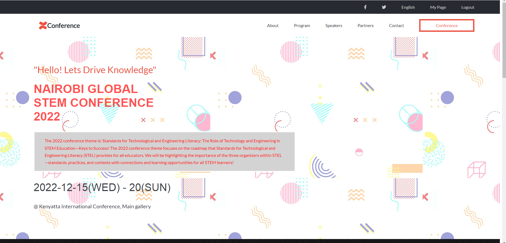

# HTML/CSS & JavaScript capstone project 
Project: HTML/CSS & JavaScript capstone project - Conference page.
 
This Project is based on an online website for a conference. 
A responsive design
 

 
 
## Built With
- HTML
- CSS
- JavaScript

 
## Live Demo
[Live Demo Link]( https://vabuyia.github.io/week-5-capsone/)

## Getting Started

- Clone the repo to your local machine.
- Open the index.html file on your browser and use.

## Authors

- Name: Vincent Abuya
- GitHub: [@githubhandle](vabuyia@gmail.com)
- Twitter: [@twitterhandle](https://twitter.com/abuyia)
- LinkedIn: [LinkedIn](vabuyia)
 
            
## 🤝 Contributing
 
Contributions, issues, and feature requests are welcome!
 
Feel free to check the [issues page](issues/).
 
## Show your support
 
Give a ⭐️ if you like this project!
 
## Acknowledgments
 
- This design is similar to the one created by  Cindy Shin. [original Link](https://www.behance.net/gallery/29845175/CC-Global-Summit-2015)
- Inspiration
- etc
 
## 📝 License
 
This project is [MIT](lic.url) licensed.
=======